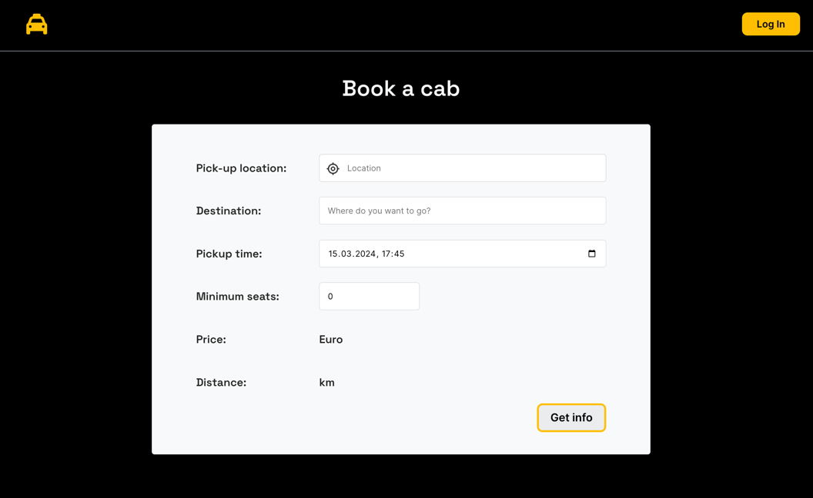
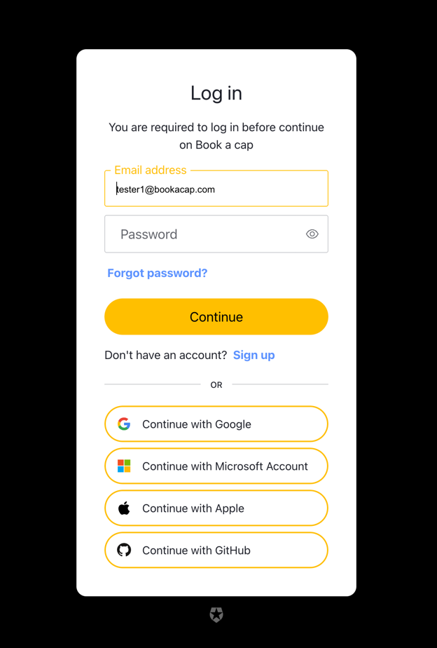
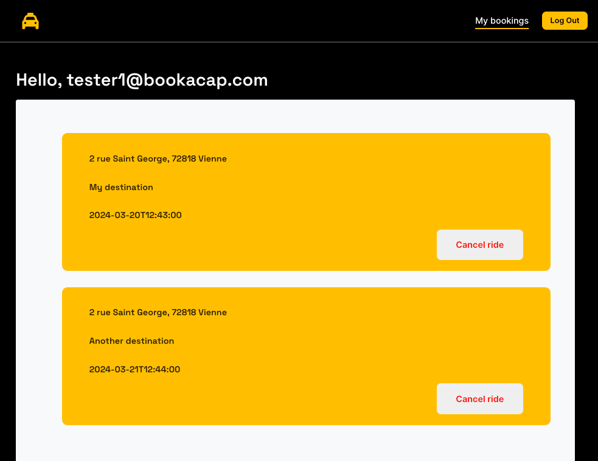

# Book-a-cab
Web app showcasing microservices with Springboot, React and Docker Swamp

## Microservices architecture for Springboot with Docker
Each Springboot application (```cap-booking```, ```distance```, and ```cap-price-calculator```) is seen as a microservice,
for which a Docker image is built and pushed to [Docker Hub](https://hub.docker.com/) thanks to the maven plugin ```maven-antrun-plugin```.

The React UI application _**book-a-cap-ui**_ is also deployed in its own container.

Thanks to Docker, a service can be reached via its Docker service name instead of the host url. This refects the Microservice 
architecture. 

The ```docker-compose.yml``` defines the containers. They are in the same network and are visible for each other. 
This can be propagated to be used in Docker Swamp mode as well.

For the sake of simplicity, the server is using an embedded H2 database but this can be connected with other databases, of course. 

### Screenshots
App homepage developed in React


Oauth2 by Okta is used for user authentication, thus eliminates the need to manage users on application's level.
Database schema for bookings is kept compact and clean.



Users can see his bookings that are only his.
